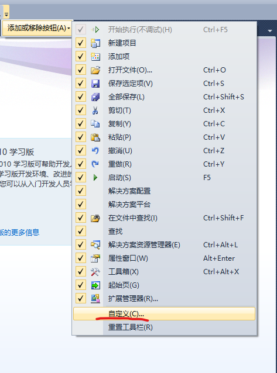

# 计算机二级考试 C语言笔记 #  
## 一. VC++ 2010的使用 ##  
### 1. 添加 开始执行(不调试) 按钮 ###  
#### 1）单击工具栏中的小三角 ####  

  

#### 2）点击添加或移除按钮 ####  

  

#### 3）单击自定义 ####  

  

#### 4）添加命令 ####  

  

 按钮")  

****  

#### ⚠*注意：在考试时请不要直接打开源文件，而应该打开以.sln结尾的项目文件。* ####  

  

  

****  

#### ⚠*注意：在考试时请务必**全部保存并运行出结果后**再退出IDE。* ####  

**技巧 文件-全部保存：Ctrl+Shift+S，然后点击开始执行(不调试) 按钮：Ctrl+F5**  

****  

### 2.Windows操作系统中的暂停函数 ###  

```C
#include <stdio.h>
#include <stdlib.h>
/* 头文件stdlib.h包含system函数 */

int main(void)
{
	printf("Hello,world!\n");

	system("pause"); // 调用暂停函数
	return 0;

}
```  

****  

#### ⚠*注意：如果在Windows操作系统中没有调用暂停函数，输出的结果将会“一闪而过”。* ####  

****  

## 二. 数据结构与算法 ##  
### 1. 二叉树 ###  
#### 1）二叉树的定义 ####  
① 本身是**有序树**；  

② 树中包含的**各个节点**的***度*** **不能超过 2，即只能是 0、1 或者 2。**  

****  

⚠**注意：有序树与无序树的区别**  

**有序树：**  
树中任意节点的子结点之间***有顺序关系***，这种树称为有序树；  

**无序树：**  
树中任意节点的子结点之间***没有顺序关系***，这种树称为无序树,也称为自由树。  

****  

#### 2）二叉树的深度 ####  
**也称为树的高度，树中所有结点的层次最大值称为树的深度**  

❓输入一棵二叉树的根结点，求该树的深度。  

❗ 树中所有结点的层次最大值为4，因此树的深度为4  


  

